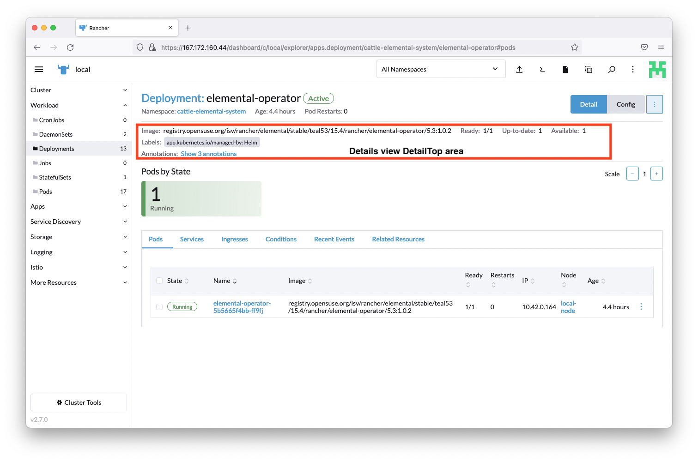
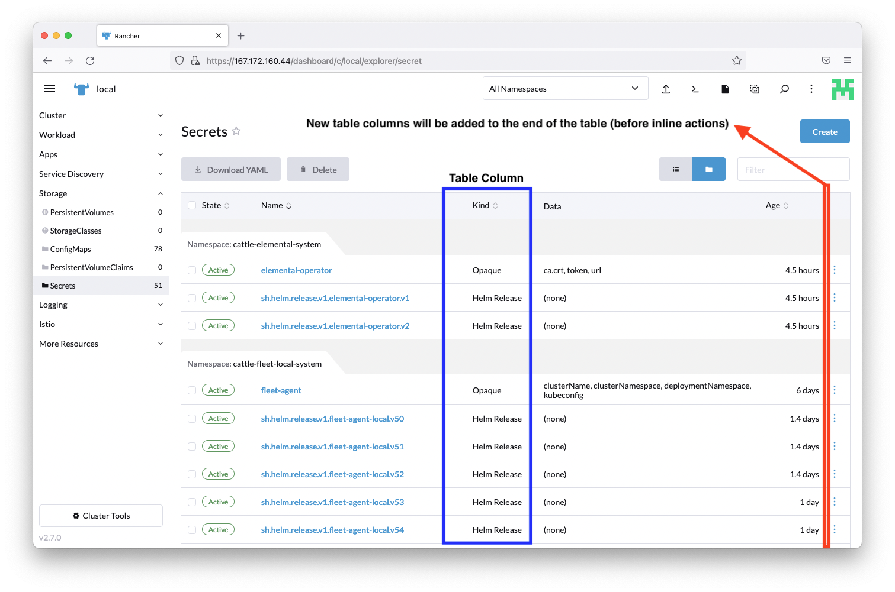

# Extensions API

## Introduction

Rancher Extensions provides a mechanism to add new functionality to the Dashboard UI at runtime. This is covered mostly by the Extensions API which provides several methods on the `plugin` object to enhance the Rancher Dashboard UI in key areas of the interface. They should be defined where the extension is initialized.

In order understand how these methods work, there are some key concepts that should be learnt, like:

## `locationConfig` object definition

The `locationConfig` object defines **where** (which area of the UI) and **when** (product, resource, cluster...) these UI enhancement methods are applied on the UI. The **when** is based on the current routing system employed on Rancher Dashboard. Let's take on a simple example to try and understand the routing structure.

Example URL:
```
<INSTANCE-BASE-URL>/dashboard/c/local/explorer/apps.deployment/cattle-system/rancher-webhook
```

How to recognize the URL structure on the example above:

```
<INSTANCE-BASE-URL>/dashboard/c/<CLUSTER-ID>/<PRODUCT-ID>/<RESOURCE-ID>/<NAMESPACE-ID>/<ID>
```

**Note:** There are Kubernetes resources that aren't namespaced, such as `catalog.cattle.io.clusterrepo`, and in those cases the following structure applies:

```
<INSTANCE-BASE-URL>/dashboard/c/<CLUSTER-ID>/<PRODUCT-ID>/<RESOURCE-ID>/<ID>
```

There is another different routing pattern for "extensions as products" which follows a slightly different convention of the core Rancher Dashboard routes. An example of this would be:

```
<INSTANCE-BASE-URL>/dashboard/elemental/c/local/elemental.cattle.io.machineinventory/nvxml-6mtga
```

which translates to:

```
<INSTANCE-BASE-URL>/dashboard/<PRODUCT-ID>/c/<CLUSTER-ID>/<RESOURCE-ID>/<ID>
```

With this it's then possible to easily identify the parameters needed to populate the `locationConfig` and add the UI enhancements to the areas that you like. YES, it's possible to also even enhance other extensions!


The admissable parameters for the `locationConfig` object are:
| Key | Type | Description |
|---|---|---|
|`where`| String | The identifier of the UI area where to apply the given enhancement |
|`when`| Object | the `locationObject` which is based on the Vue router experience above described |


The admissable parameters for the `locationObject` object are:

| Key | Type | Description |
|---|---|---|
|`product`| String | The product identifier. Ex: `fleet`, `manager` (Cluster Management), `harvesterManager` (Virtualization Management), `explorer` (Cluster Explorer) or `home` (Homepage) |
|`resource`| String | The identifier of the kubernetes resource to be bound to. Ex: `apps.deployment`, `storage.k8s.io.storageclass` or `secret`  |
|`namespace`| String | The namespace identifier. Ex: `kube-system`, `cattle-global-data` or `cattle-system` |
|`cluster`| String | The cluster identifier. Ex: `local` |
|`id`| String | The identifier for a given resource. Ex: `deployment-unt6xmz` |
|`mode`| String | Relates to the type of view on which the given enhancement should be applied. Admissable values are: `edit`, `config`, `detail` and `list` |

### Examples

Example 1:
```
{
  where: '...',
  when: {}
}
```

Passing an empty object as a `locationObject` will apply a given extension enhancement to all locations where it can be apllied.

Example 2:
```
{
  where: '...',
  when: { product: 'home' }
}
```

Extension enhancement will be applied on the homepage of rancher dashboard (if applicable).

Example 3:
```
{
  where: '...',
  when: { resource: 'pod', id: 'pod-nxr5vm' }
}
```

Extension enhancement will be applied on the resource `pod` with id `pod-nxr5vm` (if applicable).

Example 4:
```
{
  where: '...',
  when: { 
    cluster:  'local', 
    resource: 'catalog.cattle.io.clusterrepo', 
    mode:     'edit' 
  }
}
```

Extension enhancement will be applied on the `edit` view/mode of the resource `catalog.cattle.io.clusterrepo` inside the `local` cluster (if applicable).

<br/>
<br/>

## Extension API methods

### `addAction`
This method adds a button/action to the UI.

Method:

```
plugin.addAction(locationConfig: Object, options: Object)
```

_Arguments_

`locationConfig` as described above for the [locationConfig object](#locationconfig-object-definition).

`locationConfig.where` string parameter admissable values:

| Key | Type | Description |
|---|---|---|
|`header`| String | Add a button to the Header component |
|`table`| String | Add a button/action to any `SortableTable`/table |

<br/>
<br/>

#### **`where: 'header'`** option


`options` config object. Admissable parameters for the `options` with `where: 'header'` are:

| Key | Type | Description |
|---|---|---|
|`tooltip`| String | Text for tooltip of button |
|`tooltipKey`| String | Same as "tooltip" but allows for translation. Will superseed "tooltip" |
|`shortcutLabel`| Function | Adds shortcut label to tooltip |
|`shortcutKey`| Object | Shortcut key binding |
|`icon`| String | icon name (based on [rancher icons](https://rancher.github.io/icons/)) |
|`enabled`| Function | Whether the action/button is enabled or not |
|`clicked`| Function | function executed when action/button is clicked |

Usage example for `where: 'header'`:

```
plugin.addAction(
  {
    where: 'header',
    when:  {}
  },
  {
    tooltipKey: 'generic.customize',
    tooltip:    'Test Action1',
    shortcutLabel() {
      return isMac ? '(\u2318-M)' : '(Ctrl+M)';
    },
    shortcutKey: { windows: ['ctrl', 'm'], mac: ['meta', 'm'] },
    icon:        'icon-pipeline',
    enabled(ctx: any) {
      return true;
    },
    clicked() {
      console.log('action executed 1', this.$route); // eslint-disable-line no-console
    }
  }
);
```
<br/>
<br/>

#### **`where: 'table'`** option

_INLINE TABLE ACTION_


_BULKABLE/GLOBAL TABLE ACTION_


`options` config object. Admissable parameters for the `options` with `where: 'table'` are:

| Key | Type | Description |
|---|---|---|
|`action`| String | Unique identifier for the action |
|`label`| String | Action label |
|`labelKey`| String | Same as "label" but allows for translation. Will superseed "label" |
|`icon`| String | icon name (based on [rancher icons](https://rancher.github.io/icons/)) |
|`enabled`| Boolean | Whether the action/button is enabled or not |
|`clicked`| Function | function executed when action/button is clicked (non-bulkable mode) |
|`divider`| Boolean | Shows a line separator (divider) in actions menu |
|`bulkable`| Boolean | Whether the action/button is bulkable (can be performed on multiple list items) |
|`bulkAction`| Function | Function exectued when bulklable action/button is clicked (only bulkable mode) |


Usage example for `where: 'table'`:

_RENDERING A SIMPLE DIVIDER_

```
plugin.addAction( 
  { 
    where: 'table',
    when: { resource: 'catalog.cattle.io.clusterrepo' }
  }, 
  { divider: true });
```


_CONFIGURING A NON-BULKABLE ACTION (inline action)_

```
plugin.addAction(
  { 
    where: 'table',
    when: { resource: 'catalog.cattle.io.clusterrepo' }
  }, 
  {
    action:   'some-extension-action',
    label:    'some-extension-action',
    labelKey: 'generic.customize',
    icon:     'icon-pipeline',
    enabled:  true,
    clicked() {
      console.log('table action executed1', this);
    }
  }
);
```


_CONFIGURING AN INLINE AND BULKABLE ACTION_

```
plugin.addAction(
  { 
    where: 'table',
    when: { resource: 'catalog.cattle.io.clusterrepo' }
  }, 
  {
    action:   'some-bulkable-action',
    label:    'some-bulkable-action',
    labelKey: 'generic.comingSoon',
    icon:     'icon-pipeline',
    bulkable: true,
    enabled:  true,
    clicked() {
      console.log('table action executed2', this);
    },
    bulkAction(args: any) {
      console.log('bulk table action executed', this, args);
    }
  }
);
```

### `addTab`
This method adds a tab to the UI.

Method:

```
plugin.addTab(locationConfig: Object, options: Object)
```

_Arguments_

`locationConfig` as described above for the [locationConfig object](#locationconfig-object-definition).

`locationConfig.where` string parameter admissable values:
| Key | Type | Description |
|---|---|---|
|`resourceTabs`| String | Adds a tab to the `ResourceTabs` component |

<br/>
<br/>

#### **`where: 'resourceTabs'`** option


`options` config object. Admissable parameters for the `options` with `where: 'resourceTabs'` are:

| Key | Type | Description |
|---|---|---|
|`name`| String | Query param name used in url when tab is active/clicked |
|`label`| String | Text for the tab label |
|`labelKey`| String | Same as "label" but allows for translation. Will superseed "label" |
|`weight`| Int | Defines the order on which the tab is displayed in relation to other tabs in the component |
|`showHeader`| Boolean | Whether the tab header is displayed or not |
|`tooltip`| String | Tooltip message (on tab header) |
|`clicked`| Function | Component to be displayed as tab content |

Usage example:

```
plugin.addTab( 
  { 
    where: 'resourceTabs',
    when: { resource: 'pod' }
  }, 
  {
    name:       'some-name',
    labelKey:   'generic.comingSoon',
    label:      'some-label',
    weight:     -5,
    showHeader: true,
    tooltip:    'this is a tooltip message',
    component:  () => import('./MyTabComponent.vue')
  }
);
```


### `addPanel`
This method adds a panel/content to the UI.

Method:

```
plugin.addPanel(locationConfig: Object, options: Object)
```

_Arguments_

`locationConfig` as described above for the [locationConfig object](#locationconfig-object-definition).

`locationConfig.where` string parameter admissable values:

| Key | Type | Description |
|---|---|---|
|`detailsMasthead`| String | Add a panel/content to the "detail view" Masthead component |
|`detailTop`| String | Add a panel/content to the "detail view" detailTop component |
|`listView`| String | Add a panel/content to a list view (above the table) |

<br/>
<br/>

#### **`where: 'detailsMasthead'`** option


`options` config object. Admissable parameters for the `options` with `where: 'detailsMasthead'` are:

| Key | Type | Description |
|---|---|---|
|`component`| String | Component to be rendered as content on the "detail view" Masthead component |

Usage example for `where: 'detailsMasthead'`:

```
plugin.addPanel(
  {
    where: 'detailsMasthead',
    when:  { resource: 'catalog.cattle.io.clusterrepo' }
  },
  { component: () => import('./MastheadDetailsComponent.vue') });
```

<br/>
<br/>

#### **`where: 'detailTop'`** option



`options` config object. Admissable parameters for the `options` with `where: 'detailTop'` are:

| Key | Type | Description |
|---|---|---|
|`component`| String | Component to be rendered as content on the "detail view" detailTop component |

Usage example for `where: 'detailTop'`:

```
plugin.addPanel(
  {
    where: 'detailTop',
    when:  { resource: 'catalog.cattle.io.clusterrepo' }
  },
  { component: () => import('./DetailTopComponent.vue') });
```

<br/>
<br/>

#### **`where: 'listView'`** option


`options` config object. Admissable parameters for the `options` with `where: 'listView'` are:

| Key | Type | Description |
|---|---|---|
|`component`| String | Component to be rendered as content above a table on a "list view" |

Usage example for `where: 'listView'`:

```
plugin.addPanel(
  {
    where: 'listView',
    when:  { resource: 'catalog.cattle.io.app' }
  },
  { component: () => import('./BannerComponent.vue') });
```

<br/>
<br/>

### `addCard`

This method adds a card element to the UI.

Method:

```
plugin.addCard(locationConfig: Object, options: Object)
```

_Arguments_

`locationConfig` as described above for the [locationConfig object](#locationconfig-object-definition).

`locationConfig.where` string parameter admissable values:

| Key | Type | Description |
|---|---|---|
|`clusterDashboard`| String | Add a card element to the Cluster Dashboard view  |

<br/>
<br/>

#### **`where: 'clusterDashboard'`** option


`options` config object. Admissable parameters for the `options` with `where: 'clusterDashboard'` are:

| Key | Type | Description |
|---|---|---|
|`label`| String | Card title |
|`labelKey`| String | Same as "label" but allows for translation. Will superseed "label" |
|`component`| String | Component to be rendered aas content of a "Cluster Dashboard Card" |

Usage example for `where: 'clusterDashboard'`:

```
plugin.addCard(
  {
    where: 'clusterDashboard',
    when:  { cluster: 'local' }
  },
  {
    label:     'some-label',
    labelKey:  'generic.comingSoon',
    component: () => import('./MastheadDetailsComponent.vue')
  }
);
```

<br/>
<br/>

### `addTableColumn`

This method adds a table column to a `SortableTable`/`ResourceList` element-based table on the UI.

Method:

```
plugin.addTableColumn(locationConfig: Object, options: Object)
```

_Arguments_

`locationConfig` as described above for the [locationConfig object](#locationconfig-object-definition).

`locationConfig.where` string parameter admissable values:

| Key | Type | Description |
|---|---|---|
|`listView`| String | Add a table column to a `SortableTable`/`ResourceList` element-based table |

<br/>
<br/>

#### **`where: 'listView'`** option



`options` config object. Admissable parameters for the `options` with `where: 'listView'` are:

| Key | Type | Description |
|---|---|---|
|`name`| String | Label for column |
|`labelKey`| String | Same as "name" but allows for translation. Will superseed "name" |
|`value`| String | Object property to obtain the value from |
|`getValue`| Fuction | Same as "value", but it can be a function. Will superseed "value" |
|`width`| Int | Column width (in px) |
|`sort`| Array | Object properties to be bound to the table sorting |
|`search`| Array | Object properties to be bound to the table search |

Usage example for `where: 'listView'`:

```
plugin.addTableColumn(
  {
    where: 'listView',
    when:  { resource: 'configmap' }
  },
  {
    name:     'some-prop-col',
    labelKey: 'generic.comingSoon',
    getValue: (row: any) => {
      return `${ row.id }-THIS-IS-A-DEMO-COL-VALUE!`;
    },
    width: 100,
    sort: ['stateSort', 'nameSort'],
    search: ['stateSort', 'nameSort'],
  }
);
```

<br/>
<br/>
